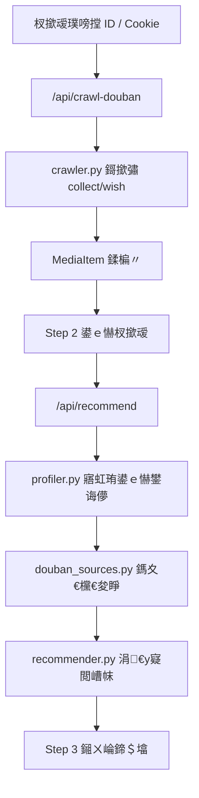

# 璞嗙摚鐖櫕涓庢帹鑽愬櫒 UI 閲嶅仛璁捐

鏃ユ湡锛?026-07-06
椤圭洰锛歚C:\path\to\douban-taste-recommender`

## 鐩爣

鎶婄幇鏈夆€滆眴鐡ｅ彛鍛冲奖瑙嗘帹鑽愬櫒鈥濆崌绾т负涓€涓笉渚濊禆澶栭儴瀵煎嚭宸ュ叿鐨勬湰鍦板簲鐢細

1. 鐢ㄦ埛鍙互鐩存帴杈撳叆璞嗙摚鐢ㄦ埛 ID 鎶撳彇鑷繁鐨勨€滅湅杩?鎯崇湅鈥濇暟鎹€?2. 鐢ㄦ埛鍙€夌矘璐?Cookie锛屼互渚挎姄鍙栫櫥褰曞悗鍙鐨勮瘎鍒嗗垎椤点€?3. UI 浠庡綋鍓嶅爢鍙犲紡琛ㄥ崟鏀逛负娓呮櫚鐨勪笁姝ユ祦绋嬨€?4. 鎻愪緵 Cookie 鑾峰彇鏁欑▼锛岄檷浣庝娇鐢ㄩ棬妲涖€?5. 淇濈暀鐜版湁鎺ㄨ崘绠楁硶锛屽苟璁╂帹鑽愮粨鏋滄洿瀹规槗鐞嗚В銆?
## 闈炵洰鏍?
- 涓嶇牬瑙ｈ眴鐡ｇ櫥褰曪紝涓嶇粫杩囬獙璇佺爜锛屼笉鍋氳嚜鍔ㄧ櫥褰曘€?- 涓嶄繚瀛樼敤鎴?Cookie 鍒扮鐩樸€?- 涓嶄笂浼犵敤鎴?Cookie 鎴栬瘎鍒嗘暟鎹埌澶栭儴鏈嶅姟銆?- 涓嶅仛澶у瀷鍓嶇妗嗘灦杩佺Щ锛岀户缁娇鐢ㄥ綋鍓嶆棤渚濊禆鏈湴 Web 鏈嶅姟銆?- 涓嶄繚璇佹姄鍙栨墍鏈夌瀵嗘暟鎹紱鍙兘鎶撳彇璞嗙摚椤甸潰杩斿洖涓旂敤鎴锋湁鏉冮檺鐪嬪埌鐨勫唴瀹广€?
## 鐢ㄦ埛娴佺▼

### Step 1锛氭姄鍙栨垜鐨勮眴鐡ｆ暟鎹?
椤甸潰灞曠ず涓や釜杈撳叆鏂瑰紡锛?
1. 璞嗙摚鐢ㄦ埛 ID 鎴栦富椤甸摼鎺?
   - 绀轰緥锛歚https://www.douban.com/people/xxxx/`
   - 绀轰緥锛歚xxxx`
2. 鍙€?Cookie
   - 绌?Cookie锛氭姄鍙栧叕寮€鍙椤甸潰銆?   - 鏈?Cookie锛氫互鐢ㄦ埛褰撳墠鐧诲綍鎬佹姄鍙栧彲瑙侀〉闈€?
鎸夐挳锛?
- `寮€濮嬫姄鍙朻
- `鏌ョ湅 Cookie 鏁欑▼`
- `浣跨敤绀轰緥鏁版嵁`

鎶撳彇瀹屾垚鍚庡睍绀猴細

- 鐪嬭繃鏁伴噺
- 鎯崇湅鏁伴噺
- 鎴愬姛椤垫暟
- 璺宠繃/澶辫触椤垫暟
- 鏈€杩戞姄鍒扮殑 5 鏉℃暟鎹?
### Step 2锛氬憡璇夋垜浣犵殑鍙ｅ懗

鎶婂綋鍓嶅垎鏁ｇ殑澶ф枃鏈鏁寸悊鎴愮煭鑰屾槑纭殑杈撳叆锛?
- 鍠滄鐨勫彛鍛筹細渚嬪 `鎮枒, 鐘姜, 鐜板疄涓讳箟, 榛戣壊骞介粯`
- 涓嶅枩娆㈢殑鍙ｅ懗锛氫緥濡?`鐢滃疇, 鐙楄, 浣庡辜, 鎭愭€栬鑵
- 鎺ㄨ崘鑼冨洿锛?  - 鐢靛奖
  - 鐢佃鍓?  - 鐢靛奖 + 鐢佃鍓?- 鍊欓€夋潵婧愶細
  - 璞嗙摚鎺㈢储鍊欓€夋睜
  - 璞嗙摚 Top250
  - 鏈湴绀轰緥鍊欓€?
### Step 3锛氭煡鐪嬫帹鑽?
缁撴灉鏀逛负鈥滄憳瑕佷紭鍏堬紝璇︽儏鍙睍寮€鈥濓細

- 鍗＄墖榛樿灞曠ず锛?  - 鏍囬
  - 绫诲瀷
  - 璞嗙摚璇勫垎
  - 涓€у寲鍒?  - 3 涓互鍐呮帹鑽愮悊鐢?  - 璞嗙摚閾炬帴
- 鐐瑰嚮鈥滃睍寮€璇︽儏鈥濆悗灞曠ず锛?  - 鍖归厤鐨勯珮鍒嗗亸濂?  - 鍙兘韪╅浄鐐?  - 鏉ユ簮
  - 瀵兼紨/涓绘紨/鏍囩

## Cookie 鏁欑▼鏂囨

椤甸潰鍐呮彁渚涘彲鎶樺彔鏁欑▼锛?
1. 鎵撳紑娴忚鍣ㄥ苟鐧诲綍璞嗙摚銆?2. 杩涘叆浠绘剰璞嗙摚椤甸潰锛屼緥濡?`https://movie.douban.com/`銆?3. 鎸?`F12` 鎵撳紑寮€鍙戣€呭伐鍏枫€?4. 閫夋嫨 `Network / 缃戠粶`銆?5. 鍒锋柊椤甸潰銆?6. 鐐瑰嚮浠绘剰 `movie.douban.com` 鎴?`www.douban.com` 璇锋眰銆?7. 鍦ㄥ彸渚?`Headers / 鏍囧ご` 涓壘鍒?`Request Headers`銆?8. 澶嶅埗鍏朵腑鐨?`Cookie: ...` 鍚庨潰鐨勬暣娈靛唴瀹广€?9. 绮樿创鍒版湰搴旂敤鐨?Cookie 杈撳叆妗嗐€?
鎻愮ず鏂囨锛?
- Cookie 鍙敤浜庢湰鏈鸿姹傝眴鐡ｉ〉闈€?- 鏈簲鐢ㄤ笉鎶?Cookie 淇濆瓨鍒扮鐩樸€?- 濡傛灉鎶撳彇澶辫触锛屽厛纭璞嗙摚缃戦〉鏈韩鑳芥甯告墦寮€锛屽苟鍑忓皯鎶撳彇椤垫暟閲嶈瘯銆?
## 鏋舵瀯璁捐

### 鏂板妯″潡锛歚crawler.py`

鑱岃矗锛?
- 鏋勯€犺眴鐡ｇ敤鎴锋暟鎹垎椤?URL銆?- 鍙戦€佸甫 Cookie/涓嶅甫 Cookie 鐨?HTTP 璇锋眰銆?- 瑙ｆ瀽璞嗙摚鈥滅湅杩?鎯崇湅鈥濋〉闈?HTML銆?- 灏嗛〉闈㈡潯鐩浆鎹负 `MediaItem`銆?
涓昏鍑芥暟锛?
- `normalize_douban_user_id(value: str) -> str`
  - 浠庣敤鎴?ID 鎴栦富椤?URL 涓彁鍙?ID銆?- `build_user_collection_url(user_id: str, status: str, start: int) -> str`
  - status 鏀寔 `collect` 涓?`wish`銆?- `fetch_user_collection_page(user_id, status, start, cookie="") -> str`
  - 杩斿洖 HTML 瀛楃涓层€?- `parse_user_collection_html(html, status) -> list[MediaItem]`
  - 瑙ｆ瀽鏍囬銆佹垜鐨勮瘎鍒嗐€佸勾浠姐€侀摼鎺ャ€佺畝浠嬨€佹爣绛俱€?- `crawl_user_collections(user_id, cookie="", max_pages=20, include_wish=True) -> CrawlResult`
  - 鍒嗛〉鎶撳彇骞惰繑鍥炵粨鏋勫寲缁撴灉銆?
### 鏂板鏁版嵁缁撴瀯锛歚CrawlResult`

瀛楁锛?
- `items: list[MediaItem]`
- `pages_ok: int`
- `pages_failed: int`
- `errors: list[str]`
- `stopped_reason: str`

### 淇敼妯″潡锛歚web.py`

鏂板 API锛?
- `POST /api/crawl-douban`
  - 杈撳叆锛?    - `user_id_or_url`
    - `cookie`
    - `max_pages`
    - `include_wish`
  - 杈撳嚭锛?    - `items`
    - `counts`
    - `errors`

淇敼 API锛?
- `POST /api/recommend`
  - 鍏佽鐩存帴鎺ユ敹 Step 1 鎶撳埌鐨?`rated_items` JSON銆?  - 淇濇寔鍏煎鏃х殑 CSV 杈撳叆銆?
### 淇敼 UI

缁х画浣跨敤鍗曟枃浠?HTML锛屼絾閲嶆瀯涓虹粍浠跺寲 JS 鍑芥暟锛?
- `renderStepNav()`
- `renderCrawlerPanel()`
- `renderTastePanel()`
- `renderRecommendations()`
- `renderCookieGuide()`

瑙嗚鍜岃瑷€绛栫暐锛?
- 涓€灞忓彧鑱氱劍涓€涓富瑕佷换鍔°€?- 琛ㄥ崟瀛楁涓嶆í鍚戞尋鍘嬨€?- 鏂囨浣跨敤鈥滀綘瑕佸仛浠€涔?涓嬩竴姝ユ槸浠€涔堚€濈殑琛ㄨ揪銆?- 榛樿闅愯棌楂樼骇閫夐」銆?- 缁撴灉鍗＄墖榛樿鐭紝璇︽儏鎶樺彔銆?
## 鏁版嵁娴?

## 閿欒澶勭悊

### 鎶撳彇澶辫触

甯歌澶辫触涓?UI 鎻愮ず锛?
- 403 / 闇€瑕佺櫥褰曪細鎻愮ず鐢ㄦ埛绮樿创 Cookie 鎴栭噸鏂扮櫥褰曡眴鐡ｃ€?- 404锛氭彁绀虹敤鎴?ID 鎴栦富椤甸摼鎺ュ彲鑳戒笉姝ｇ‘銆?- 棰戠箒璇锋眰澶辫触锛氭彁绀洪檷浣庨〉鏁版垨绋嶅悗閲嶈瘯銆?- 椤甸潰缁撴瀯鍙樺寲锛氭彁绀哄綋鍓嶉〉闈㈡棤娉曡В鏋愶紝骞朵繚鐣欏師濮嬮敊璇€?
### 瑙ｆ瀽涓嶅畬鏁?
濡傛灉鏌愭潯鏁版嵁缂哄皯绫诲瀷銆佸婕斻€佺畝浠嬶紝涓嶄腑鏂祦绋嬶紱鎺ㄨ崘绠楁硶浼氫娇鐢ㄥ凡鏈夊瓧娈靛拰鎵嬪姩鍙ｅ懗琛ヨ冻銆?
### Cookie 瀹夊叏

- Cookie 鍙瓨鍦ㄦ祻瑙堝櫒褰撳墠椤甸潰鍐呭瓨鍜屾湰娆?POST 璇锋眰涓€?- 鏈嶅姟绔笉鍐?Cookie 鍒版枃浠躲€?- 鏃ュ織涓嶆墦鍗?Cookie銆?
## 娴嬭瘯璁捐

閲囩敤 TDD 娣诲姞娴嬭瘯鍚庡啀瀹炵幇銆?
### 鐖櫕娴嬭瘯

- `test_normalize_douban_user_id_accepts_plain_id`
- `test_normalize_douban_user_id_extracts_people_url`
- `test_build_user_collection_url_for_collect`
- `test_parse_user_collection_html_extracts_title_rating_and_url`
- `test_parse_user_collection_html_handles_no_rating`

### API 娴嬭瘯

- `test_crawl_api_returns_items_from_stubbed_fetcher`
- `test_recommend_api_accepts_json_rated_items`

### 鎺ㄨ崘鍥炲綊娴嬭瘯

- `test_recommendations_exclude_crawled_collect_items`
- `test_cookie_value_is_not_written_to_logs_or_response`

## 瀹炴柦椤哄簭

1. 娣诲姞鐖櫕瑙ｆ瀽娴嬭瘯锛岀‘璁ゅけ璐ャ€?2. 瀹炵幇 `crawler.py` 鐨勭函瑙ｆ瀽涓?URL 鍑芥暟銆?3. 娣诲姞鎶撳彇缁撴灉搴忓垪鍖栨祴璇曘€?4. 瀹炵幇 `/api/crawl-douban`銆?5. 娣诲姞鎺ㄨ崘 API 鎺ユ敹 JSON 鏁版嵁娴嬭瘯銆?6. 淇敼 `/api/recommend`銆?7. 閲嶅仛 UI 涓夋娴佺▼銆?8. 鍔犲叆 Cookie 鏁欑▼銆?9. 杩愯 smoke test锛?   - 椤甸潰鑳芥墦寮€銆?   - 绀轰緥鏁版嵁鑳芥帹鑽愩€?   - API 鑳借繑鍥炴姄鍙栫粨鏋溿€?   - 鎺ㄨ崘缁撴灉涓嶅寘鍚凡鐪嬫潯鐩€?
## 鎴愬姛鏍囧噯

- 鐢ㄦ埛涓嶇敤澶栭儴瀵煎嚭宸ュ叿鍗冲彲閫氳繃璞嗙摚 ID/Cookie 鎶撳彇鏁版嵁銆?- UI 涓嶅啀鏄墍鏈夎〃鍗曞爢鍦ㄤ竴璧凤紝鑰屾槸涓夋瀹屾垚銆?- Cookie 鏁欑▼鑳芥寚瀵兼櫘閫氱敤鎴峰畬鎴愬鍒躲€?- 绀轰緥鏁版嵁鎺ㄨ崘浠嶅彲鐢ㄣ€?- 鏂板娴嬭瘯鍜?smoke test 閫氳繃銆?- README 鏇存柊杩愯鏂瑰紡鍜?Cookie 鏁欑▼銆?
