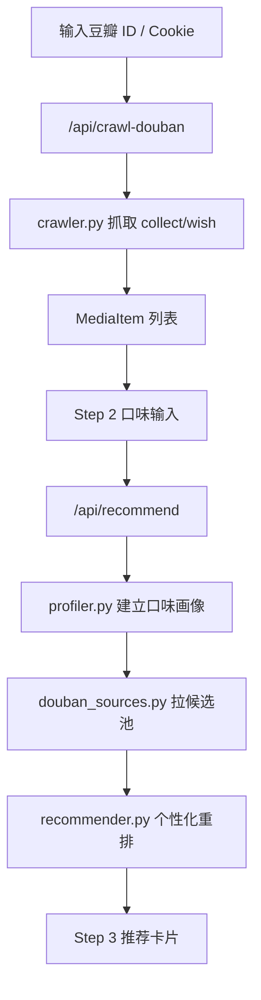

# 豆瓣爬虫与推荐器 UI 重做设计

日期：2026-07-06  
项目：`C:\Users\11616\douban-taste-recommender`

## 目标

把现有“豆瓣口味影视推荐器”升级为一个不依赖外部导出工具的本地应用：

1. 用户可以直接输入豆瓣用户 ID 抓取自己的“看过/想看”数据。
2. 用户可选粘贴 Cookie，以便抓取登录后可见的评分分页。
3. UI 从当前堆叠式表单改为清晰的三步流程。
4. 提供 Cookie 获取教程，降低使用门槛。
5. 保留现有推荐算法，并让推荐结果更容易理解。

## 非目标

- 不破解豆瓣登录，不绕过验证码，不做自动登录。
- 不保存用户 Cookie 到磁盘。
- 不上传用户 Cookie 或评分数据到外部服务。
- 不做大型前端框架迁移，继续使用当前无依赖本地 Web 服务。
- 不保证抓取所有私密数据；只能抓取豆瓣页面返回且用户有权限看到的内容。

## 用户流程

### Step 1：抓取我的豆瓣数据

页面展示两个输入方式：

1. 豆瓣用户 ID 或主页链接  
   - 示例：`https://www.douban.com/people/xxxx/`
   - 示例：`xxxx`
2. 可选 Cookie  
   - 空 Cookie：抓取公开可见页面。
   - 有 Cookie：以用户当前登录态抓取可见页面。

按钮：

- `开始抓取`
- `查看 Cookie 教程`
- `使用示例数据`

抓取完成后展示：

- 看过数量
- 想看数量
- 成功页数
- 跳过/失败页数
- 最近抓到的 5 条数据

### Step 2：告诉我你的口味

把当前分散的大文本框整理成短而明确的输入：

- 喜欢的口味：例如 `悬疑, 犯罪, 现实主义, 黑色幽默`
- 不喜欢的口味：例如 `甜宠, 狗血, 低幼, 恐怖血腥`
- 推荐范围：
  - 电影
  - 电视剧
  - 电影 + 电视剧
- 候选来源：
  - 豆瓣探索候选池
  - 豆瓣 Top250
  - 本地示例候选

### Step 3：查看推荐

结果改为“摘要优先，详情可展开”：

- 卡片默认展示：
  - 标题
  - 类型
  - 豆瓣评分
  - 个性化分
  - 3 个以内推荐理由
  - 豆瓣链接
- 点击“展开详情”后展示：
  - 匹配的高分偏好
  - 可能踩雷点
  - 来源
  - 导演/主演/标签

## Cookie 教程文案

页面内提供可折叠教程：

1. 打开浏览器并登录豆瓣。
2. 进入任意豆瓣页面，例如 `https://movie.douban.com/`。
3. 按 `F12` 打开开发者工具。
4. 选择 `Network / 网络`。
5. 刷新页面。
6. 点击任意 `movie.douban.com` 或 `www.douban.com` 请求。
7. 在右侧 `Headers / 标头` 中找到 `Request Headers`。
8. 复制其中的 `Cookie: ...` 后面的整段内容。
9. 粘贴到本应用的 Cookie 输入框。

提示文案：

- Cookie 只用于本机请求豆瓣页面。
- 本应用不把 Cookie 保存到磁盘。
- 如果抓取失败，先确认豆瓣网页本身能正常打开，并减少抓取页数重试。

## 架构设计

### 新增模块：`crawler.py`

职责：

- 构造豆瓣用户数据分页 URL。
- 发送带 Cookie/不带 Cookie 的 HTTP 请求。
- 解析豆瓣“看过/想看”页面 HTML。
- 将页面条目转换为 `MediaItem`。

主要函数：

- `normalize_douban_user_id(value: str) -> str`
  - 从用户 ID 或主页 URL 中提取 ID。
- `build_user_collection_url(user_id: str, status: str, start: int) -> str`
  - status 支持 `collect` 与 `wish`。
- `fetch_user_collection_page(user_id, status, start, cookie="") -> str`
  - 返回 HTML 字符串。
- `parse_user_collection_html(html, status) -> list[MediaItem]`
  - 解析标题、我的评分、年份、链接、简介、标签。
- `crawl_user_collections(user_id, cookie="", max_pages=20, include_wish=True) -> CrawlResult`
  - 分页抓取并返回结构化结果。

### 新增数据结构：`CrawlResult`

字段：

- `items: list[MediaItem]`
- `pages_ok: int`
- `pages_failed: int`
- `errors: list[str]`
- `stopped_reason: str`

### 修改模块：`web.py`

新增 API：

- `POST /api/crawl-douban`
  - 输入：
    - `user_id_or_url`
    - `cookie`
    - `max_pages`
    - `include_wish`
  - 输出：
    - `items`
    - `counts`
    - `errors`

修改 API：

- `POST /api/recommend`
  - 允许直接接收 Step 1 抓到的 `rated_items` JSON。
  - 保持兼容旧的 CSV 输入。

### 修改 UI

继续使用单文件 HTML，但重构为组件化 JS 函数：

- `renderStepNav()`
- `renderCrawlerPanel()`
- `renderTastePanel()`
- `renderRecommendations()`
- `renderCookieGuide()`

视觉和语言策略：

- 一屏只聚焦一个主要任务。
- 表单字段不横向挤压。
- 文案使用“你要做什么/下一步是什么”的表达。
- 默认隐藏高级选项。
- 结果卡片默认短，详情折叠。

## 数据流

## 错误处理

### 抓取失败

常见失败与 UI 提示：

- 403 / 需要登录：提示用户粘贴 Cookie 或重新登录豆瓣。
- 404：提示用户 ID 或主页链接可能不正确。
- 频繁请求失败：提示降低页数或稍后重试。
- 页面结构变化：提示当前页面无法解析，并保留原始错误。

### 解析不完整

如果某条数据缺少类型、导演、简介，不中断流程；推荐算法会使用已有字段和手动口味补足。

### Cookie 安全

- Cookie 只存在浏览器当前页面内存和本次 POST 请求中。
- 服务端不写 Cookie 到文件。
- 日志不打印 Cookie。

## 测试设计

采用 TDD 添加测试后再实现。

### 爬虫测试

- `test_normalize_douban_user_id_accepts_plain_id`
- `test_normalize_douban_user_id_extracts_people_url`
- `test_build_user_collection_url_for_collect`
- `test_parse_user_collection_html_extracts_title_rating_and_url`
- `test_parse_user_collection_html_handles_no_rating`

### API 测试

- `test_crawl_api_returns_items_from_stubbed_fetcher`
- `test_recommend_api_accepts_json_rated_items`

### 推荐回归测试

- `test_recommendations_exclude_crawled_collect_items`
- `test_cookie_value_is_not_written_to_logs_or_response`

## 实施顺序

1. 添加爬虫解析测试，确认失败。
2. 实现 `crawler.py` 的纯解析与 URL 函数。
3. 添加抓取结果序列化测试。
4. 实现 `/api/crawl-douban`。
5. 添加推荐 API 接收 JSON 数据测试。
6. 修改 `/api/recommend`。
7. 重做 UI 三步流程。
8. 加入 Cookie 教程。
9. 运行 smoke test：
   - 页面能打开。
   - 示例数据能推荐。
   - API 能返回抓取结果。
   - 推荐结果不包含已看条目。

## 成功标准

- 用户不用外部导出工具即可通过豆瓣 ID/Cookie 抓取数据。
- UI 不再是所有表单堆在一起，而是三步完成。
- Cookie 教程能指导普通用户完成复制。
- 示例数据推荐仍可用。
- 新增测试和 smoke test 通过。
- README 更新运行方式和 Cookie 教程。
