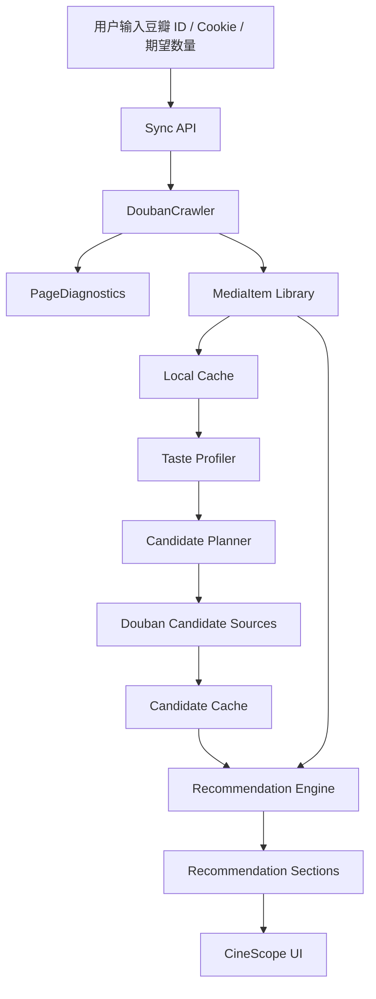

# CineScope Studio 完整版设计

日期：2026-07-07  
项目：`C:\path\to\douban-taste-recommender`
分支：`douban-crawler-ui-redesign`

## 1. 产品定位

CineScope Studio 是一个本地运行的豆瓣私人影视策展器。它不是商业化平台，也不是简单表单推荐器，而是面向个人的完整影视资料库、口味分析器和高质量推荐工作台。

目标体验：用户输入豆瓣主页或用户 ID，可选粘贴 Cookie，系统同步“看过 / 想看 / 可扩展在看”数据，诊断抓取完整度，建立本地观影画像，从豆瓣公开候选池和本地缓存中扩展电影、电视剧、动漫候选，最终以高冲击力海报墙、精选榜单和清晰理由输出推荐。

## 2. 当前问题

从用户截图和现有代码看，现版主要问题是：

1. 抓取结果不可信：用户真实数据约为 242 部看过、34 部想看，但 UI 显示 0 / 0；当前代码把“解析不到条目”过早等同于“空白分页”。
2. 抓取诊断不足：只展示成功页和失败页，不能区分登录拦截、隐私权限、页面结构变化、真实空页、网络失败。
3. 页数上限偏保守：默认 8 页不足以覆盖 242 条看过记录；需要更大的默认值和上限。
4. 候选池偏薄：现版主要围绕电影和电视剧，动漫支持弱，候选页数少，推荐数量少。
5. 口味输入死板：用户偏好多元，不应过度依赖固定喜欢 / 不喜欢词；默认应采用“高评分 + 剧情好 + 口碑稳”。
6. UI 缺少吸引力：推荐页没有海报、简介、视觉层次、分区和沉浸式呈现。
7. README 存在编码显示问题，项目说明需要重写为清晰中文。

## 3. 目标

### 3.1 数据同步目标

- 默认抓取页数提升到 40 页。
- 抓取页数允许范围提升到 1 到 200 页。
- 支持同步：
  - 看过：`collect`
  - 想看：`wish`
  - 在看：实现 `do` 同步开关和解析尝试；如果豆瓣返回可解析内容就纳入资料库，如果不可解析则记录诊断且不阻塞看过 / 想看。
- 用户可输入期望数量：
  - 看过默认示例：242
  - 想看默认示例：34
- 抓取完成显示完整度：实际抓取数 / 期望数。
- 当第一页为 0 时，必须输出可操作诊断，而不是直接进入下一步。

### 3.2 推荐目标

推荐范围默认包含：

- 电影
- 电视剧
- 动漫 / 动画电影 / 动画剧集

默认口味策略：

```text
想看：评分高，剧情好，叙事强，人物塑造扎实，口碑佳，电影/电视剧/动漫都可以
避雷：电视剧古装，注水剧，低分狗血，粗制滥造
```

推荐结果分层：

- 首页精选：24 个
- 全部推荐：默认 120 个，上限 300 个
- 分区推荐：电影、电视剧、动漫、高分剧情、避开古装、冷门惊喜、想看优先

### 3.3 UI 目标

将现有三步表单升级为高端本地工作台，视觉参考方向为 Letterboxd 的观影气质、Apple TV 的沉浸式横幅、Criterion 的策展感。

必须包含：

- cinematic hero 区域
- 观影画像统计
- 同步完整度仪表
- 抓取诊断时间线
- 推荐分区 tabs
- 大海报墙
- 横向精选榜单
- 推荐详情抽屉
- 空状态行动指引
- 响应式布局

## 4. 非目标

- 不做自动登录流程。
- 不保存 Cookie 到磁盘。
- 不上传用户数据到外部服务。
- 不引入商业化账号、订阅、支付、广告或云同步。
- 不把复杂度用于无关功能；复杂度只服务抓取可靠性、推荐质量、视觉体验和本地资料库完整度。

## 5. 成功标准

### 5.1 抓取成功标准

1. 对 242 看过 / 34 想看的用户，默认 40 页足以覆盖数据规模。
2. 如果抓取不到数据，页面明确显示原因类别：
   - 真实空页
   - 可能需要 Cookie
   - 可能登录态失效
   - 可能被安全验证拦截
   - 页面有内容但解析器未识别
   - 网络或 HTTP 错误
3. 抓取诊断中能看到每个 status、start、URL、页面结果数量。
4. Cookie 不出现在日志、API 响应、错误消息、缓存和 README 示例中。

### 5.2 推荐成功标准

1. 推荐中同时出现电影、电视剧、动漫候选。
2. 电视剧古装内容被明显降权，并带有“电视剧古装避雷”提示。
3. 高分剧情类内容在默认排序中占优。
4. 已看条目通过标题和豆瓣 ID 双重去重排除。
5. 想看条目不被当作已看排除，而是进入“想看优先 / 已在片单”提示区。
6. 推荐结果包含海报、简介、评分、理由、风险提示和来源。

### 5.3 UI 成功标准

1. 首页不再像表单集合，而像完整影视工作台。
2. 推荐页首屏必须有海报和精选内容。
3. 用户不需要打开折叠项也能理解下一步要做什么。
4. 0 数据状态不再空洞，直接提示下一步修复动作。
5. 宽屏、笔记本和移动窄屏均可正常使用。

## 6. 总体架构



继续使用当前 Python 标准库本地 HTTP 服务，避免大型外部运行环境。为了完整性和可维护性，会把现有职责拆成更清晰的模块。

## 7. 模块设计

### 7.1 `crawler.py` 增强

职责：同步豆瓣用户收藏页，输出条目和诊断。

新增 / 修改数据结构：

```python
@dataclass
class PageDiagnostic:
    status: str
    start: int
    url: str
    http_status: int | None
    item_count: int
    classification: str
    message: str

@dataclass
class CrawlResult:
    items: list[MediaItem]
    pages_ok: int
    pages_failed: int
    errors: list[str]
    stopped_reason: str
    diagnostics: list[PageDiagnostic]
    expected_collect: int | None
    expected_wish: int | None
    completeness: dict[str, object]
```

解析策略：

- 保留现有 grid parser。
- 增加 list parser，识别不同页面结构中的 subject 链接、图片 alt、rating class、intro、comment。
- 增加 fallback parser：只要页面中出现 `movie.douban.com/subject/<id>/`，就尽量提取标题和链接，避免整页归零。
- 增加页面分类器：
  - `ok_with_items`
  - `true_empty_page`
  - `login_required`
  - `privacy_or_permission`
  - `security_check`
  - `parse_failed_nonempty`
  - `http_error`
  - `network_error`

停止规则：

- 某个 status 连续出现真实空页后停止该 status。
- 如果第一页是 `parse_failed_nonempty`，不进入“成功空数据”，而是返回强诊断。
- 如果 collect 或 wish 数量明显低于期望数量，UI 显示“不完整同步”。

### 7.2 `storage.py` 本地缓存

职责：缓存非敏感数据，减少重复抓取，保留上次可用结果。

缓存目录：

```text
C:\path\to\douban-taste-recommender\output\cache\
```

文件：

- `library.json`：用户看过、想看、在看条目。
- `sync_report.json`：最近一次同步诊断。
- `candidates.json`：候选池缓存。
- `recommendations.json`：最近一次推荐结果。

规则：

- Cookie 永不写入缓存。
- 缓存文件使用 UTF-8 JSON。
- 缓存损坏时自动忽略并重建。
- UI 提供“清空本地缓存”按钮。

### 7.3 `candidate_planner.py`

职责：根据画像和默认策略生成候选查询计划。

候选频道：

- `movie_quality`：电影、高分、剧情、口碑
- `movie_top`：Top250 / 高分电影
- `series_quality`：电视剧、高分、剧情、悬疑、现实、犯罪
- `anime_quality`：动画、动漫、日本动画、动画电影、番剧
- `hidden_gems`：冷门高分、评分优先、热度不过度偏置
- `wishlist_boost`：想看列表相关补充

查询计划包含：

- tags
- sort
- start offsets
- target media type
- source label
- expected count

### 7.4 `douban_sources.py` 增强

职责：拉取豆瓣公开候选池并转成 `MediaItem`。

增强点：

- 支持每个查询多个 start offset，不只 start=0。
- 支持动漫相关 tags。
- 记录查询来源，便于推荐理由解释。
- 尽量保留 cover、url、rating、directors、casts、id。
- 对候选结果去重。
- 网络失败时返回部分成功结果和诊断，不使推荐整体失败。

### 7.5 `recommender.py` 增强

职责：综合用户画像、质量优先策略、手动偏好、避雷规则进行排序。

打分层次：

1. 基础质量分：豆瓣评分、评分人数或来源可信度。
2. 剧情质量加权：剧情、悬疑、犯罪、现实、人物、叙事、口碑等关键词。
3. 用户画像分：高分看过内容的类型、国家、导演、演员、标签。
4. 手动说明分：用户自然语言输入中的正向词。
5. 避雷扣分：低分、狗血、注水、粗制滥造、低幼等。
6. 电视剧古装强降权：当 `media_type=电视剧` 且匹配古装、武侠、仙侠、宫廷、历史、朝代等词时强扣分。
7. 已看排除：collect 条目排除。
8. 想看提示：wish 条目保留为“想看优先”，但不当作普通新推荐。

推荐输出增加：

```python
section: str
badges: list[str]
quality_label: str
short_reason: str
risk_label: str
is_wishlist: bool
```

### 7.6 `profile.py / profiler.py` 增强

职责：从用户看过数据中生成更宽松的画像。

原则：

- 不因一两部低分片过度排斥大类别。
- 当用户口味多元时，默认走 quality-first。
- 高分条目权重大于低分条目。
- 没有足够评分时，使用默认高分剧情策略。

### 7.7 `web.py` API 增强

新增或修改接口：

- `POST /api/sync-douban`
  - 输入：用户 ID、Cookie、max_pages、include_wish、include_do、expected_collect、expected_wish。
  - 输出：items、counts、diagnostics、completeness、cache_status。
- `POST /api/recommend`
  - 输入：library、taste_text、avoid_text、media scopes、limit、candidate depth。
  - 输出：sections、results、profile、candidate diagnostics。
- `GET /api/cache`
  - 返回本地缓存摘要。
- `DELETE /api/cache`
  - 清空本地缓存。

保留兼容：

- 旧 `/api/crawl-douban` 可以作为 `/api/sync-douban` 的兼容别名。
- 旧 CSV 输入继续存在，作为兜底。

### 7.8 `web_ui.py` 重做

继续单文件 HTML/CSS/JS，但结构化成清晰组件函数；如果文件过大，则拆出 `ui_templates.py` 或静态文件，但默认优先保持项目易运行。

主要视图：

1. `renderHero()`：大标题、隐私提示、同步状态。
2. `renderSyncPanel()`：输入豆瓣 ID、Cookie、期望数量、页数、同步按钮。
3. `renderSyncDiagnostics()`：抓取时间线、完整度仪表、最近抓到。
4. `renderTasteStudio()`：自然语言口味说明、避雷说明、范围开关。
5. `renderRecommendationDashboard()`：分区、海报墙、精选横滑榜单。
6. `renderRecommendationCard()`：海报、评分、简介、理由、风险标签。
7. `renderDetailDrawer()`：完整详情、来源、主创、匹配特征。
8. `renderEmptyState()`：针对 0 数据、候选不足、网络失败的行动提示。

视觉系统：

- 深色电影感背景作为默认主题。
- 使用大面积渐变、poster glow、玻璃态面板、清晰层级。
- 海报缺失时生成高质量文字海报占位，而不是空白。
- 评分、类型、来源用 badge 呈现。
- 卡片 hover 或点击展开详情。
- 移动端变为单列卡片流。

默认文案：

```text
一句话告诉我最近想看什么：评分高，剧情好，叙事强，人物塑造扎实，电影/电视剧/动漫都可以
明确避雷：电视剧古装，注水剧，低分狗血，粗制滥造
```

## 8. 数据流

### 8.1 同步流程

1. 用户输入豆瓣用户 ID 或主页链接。
2. 用户可选输入 Cookie、期望数量、最大页数。
3. 前端调用 `/api/sync-douban`。
4. 后端按 status 分页抓取。
5. 每页生成 `PageDiagnostic`。
6. 解析条目进入 `MediaItem`。
7. 计算 collect / wish / do 数量和完整度。
8. 保存 library 与 sync_report 到本地缓存。
9. UI 展示同步结果和下一步按钮。

### 8.2 推荐流程

1. 用户确认自然语言口味和避雷说明。
2. 后端建立画像。
3. `candidate_planner` 生成多频道候选计划。
4. `douban_sources` 拉取公开候选并合并缓存。
5. `recommender` 排除看过、标记想看、打分、分区。
6. UI 渲染 Hero 精选、tabs 和海报墙。

## 9. 错误处理设计

### 9.1 0 / 0 同步

如果 collect 和 wish 均为 0：

- 若页面疑似登录拦截：显示“公开页不可见或需要 Cookie”。
- 若页面疑似安全验证：显示“豆瓣返回安全验证页，稍后重试或减少页数”。
- 若页面非空但无 item：显示“页面有内容但解析失败”，并展示诊断 URL 和页面分类。
- 若用户填了期望数量：显示完整度 0%，高亮“不完整”。

### 9.2 候选池不足

如果候选数不足：

- 自动启用更多 fallback queries。
- 使用缓存中的旧候选补足。
- UI 显示“当前候选较少，推荐可信度下降”。

### 9.3 海报缺失

如果没有 cover：

- 使用本地 CSS 生成文字海报。
- 卡片仍展示标题、评分、简介和理由。

### 9.4 Cookie 安全

- 前端提交后立即清空 Cookie 输入框。
- 后端错误消息统一调用 redaction。
- diagnostics 中不包含请求 header。
- cache 中不包含 Cookie。

## 10. 测试计划

### 10.1 爬虫测试

- 解析 grid 模式收藏页。
- 解析 list 模式收藏页。
- fallback parser 从 subject 链接提取基础条目。
- 首页非空但解析为 0 时分类为 `parse_failed_nonempty`。
- 登录拦截页分类为 `login_required`。
- 安全验证页分类为 `security_check`。
- 多页模拟抓取 242 collect / 34 wish。
- max_pages 默认 40，上限 200。
- Cookie redaction 覆盖错误消息和诊断。

### 10.2 缓存测试

- 保存和读取 library。
- 缓存损坏时返回空缓存并不崩溃。
- Cookie 不进入任何缓存文件。
- 清空缓存删除目标文件。

### 10.3 候选池测试

- 生成电影、电视剧、动漫查询计划。
- 每个查询支持多个 start offset。
- 候选去重按 douban_id 优先。
- 网络部分失败时保留成功结果。

### 10.4 推荐测试

- 已看 collect 被排除。
- 想看 wish 被保留并标记。
- 电视剧古装强降权。
- 高分剧情内容默认升权。
- 动漫候选能进入结果。
- 推荐 section 正确生成。

### 10.5 UI 测试

- HTML 包含 cinematic hero。
- HTML 包含同步完整度、诊断时间线、推荐 tabs。
- HTML 包含海报卡片和详情抽屉结构。
- 默认文案符合 quality-first 策略。
- 空状态包含可执行修复动作。

### 10.6 API 测试

- `/api/sync-douban` 返回 diagnostics 和 completeness。
- `/api/recommend` 返回 sections 和 results。
- `/api/cache` 返回缓存摘要。
- `DELETE /api/cache` 清空缓存。

## 11. 实施边界

本设计作为一个完整升级版本实施，但计划阶段会拆成可验证任务，顺序如下：

1. 数据模型与序列化扩展。
2. 抓取诊断和解析器增强。
3. 本地缓存。
4. 候选计划和动漫候选池。
5. 推荐算法升级。
6. API 增强。
7. UI 视觉重做。
8. README 和 Cookie 教程重写。
9. 全量测试和 smoke 验证。

每个任务都按 TDD 执行：先写失败测试，再实现，再验证通过。

## 12. 文件影响范围

预计修改或新增：

```text
src/douban_recommender/models.py
src/douban_recommender/serialization.py
src/douban_recommender/crawler.py
src/douban_recommender/storage.py
src/douban_recommender/candidate_planner.py
src/douban_recommender/douban_sources.py
src/douban_recommender/profiler.py
src/douban_recommender/recommender.py
src/douban_recommender/web.py
src/douban_recommender/web_ui.py
README.md
tests/test_crawler.py
tests/test_storage.py
tests/test_candidate_planner.py
tests/test_douban_sources.py
tests/test_recommender.py
tests/test_web_api.py
tests/test_ui_html.py
tests/test_readme.py
```

## 13. 验收命令

标准测试：

```powershell
cd C:\path\to\douban-taste-recommender
$env:PYTHONPATH="$PWD\src"
$env:PYTHONDONTWRITEBYTECODE="1"
python -m unittest discover -s tests -v
```

本地启动：

```powershell
cd C:\path\to\douban-taste-recommender
.\run_app.ps1
```

浏览器验证：

```text
http://127.0.0.1:7861
```

## 14. 用户验收场景

用户输入自己的豆瓣主页，最大页数保持默认 40，期望看过填 242，期望想看填 34。同步完成后：

1. 如果数据可见，UI 应显示接近 242 / 34 的同步结果和高完整度。
2. 如果数据不可见，UI 应明确说明原因并指导粘贴 Cookie 或查看诊断。
3. 用户进入推荐页后，应看到电影、电视剧、动漫三类内容。
4. 推荐结果应有海报、简介、评分和理由。
5. 电视剧古装应被降权或标记为避雷。
6. 整体视觉应明显区别于现有表单页面，达到私人影视策展工作台的完成度。
